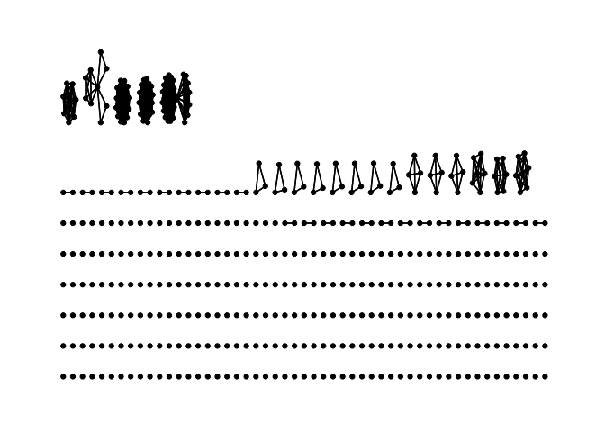

Exercise 1, Keel Scruton
================

Load required packages and import data

``` r
#install.packages("readr")
library(tidyverse)
```

    ## ── Attaching packages ─────────────────────────────────────── tidyverse 1.3.1 ──

    ## ✔ ggplot2 3.3.6     ✔ purrr   0.3.4
    ## ✔ tibble  3.1.7     ✔ dplyr   1.0.9
    ## ✔ tidyr   1.2.0     ✔ stringr 1.4.0
    ## ✔ readr   2.1.2     ✔ forcats 0.5.1

    ## ── Conflicts ────────────────────────────────────────── tidyverse_conflicts() ──
    ## ✖ dplyr::filter() masks stats::filter()
    ## ✖ dplyr::lag()    masks stats::lag()

``` r
data <- read_csv('/Users/keelscruton/Desktop/Org Network Analysis/2022-ona-assignments/Exercises/ex1/Connections.csv')
```

    ## Rows: 476 Columns: 6

    ## ── Column specification ────────────────────────────────────────────────────────
    ## Delimiter: ","
    ## chr (6): First Name, Last Name, Email Address, Company, Position, Connected On
    ## 
    ## ℹ Use `spec()` to retrieve the full column specification for this data.
    ## ℹ Specify the column types or set `show_col_types = FALSE` to quiet this message.

Here we want to obtain the counts of by employer and total count as
well.

``` r
#Counts by employer 
library(dplyr)
data %>% count(Company) %>% arrange(-n)
```

    ## # A tibble: 331 × 2
    ##    Company                                                 n
    ##    <chr>                                               <int>
    ##  1 McGill University                                      25
    ##  2 McGill University - Desautels Faculty of Management    18
    ##  3 <NA>                                                   15
    ##  4 McGill University - Macdonald Campus                   11
    ##  5 Deloitte                                                8
    ##  6 Scotiabank                                              7
    ##  7 Pratt & Whitney Canada                                  6
    ##  8 Rogers Communications                                   6
    ##  9 BOMBARDIER                                              5
    ## 10 Air Transat                                             4
    ## # … with 321 more rows

``` r
#Total count is the length of the data frame (data), can also be counted using count function. 
count(data)
```

    ## # A tibble: 1 × 1
    ##       n
    ##   <int>
    ## 1   476

Next we create nodes and edges data frames, these will be used with
igraph.

The first step will be to create a new data set that is the unique
contacts (first name + letter of first name) this is the node list (or
dataframe)

``` r
#Make a column with the first name and first letter of the last name (first_last as variable name)

data$first_last <- paste(data$`First Name`,substr(data$`Last Name`,1,1))
```

``` r
#create a distinct list of all contact first_last names, name this column label. 
nodes <- data %>%
  distinct(`first_last`) %>%
  rename(label = first_last)

#set a unique ID value. 
nodes <- nodes %>% rowid_to_column("id")
```

The next step is to create the Edge List

``` r
edges =data %>% select(first_last, Company) %>%
  inner_join(., select(., first_last, Company), by = "Company") %>%
  rename(INDIVIDUAL1 = first_last.x, INDIVIDUAL2 = first_last.y) %>%
  filter(INDIVIDUAL1 != INDIVIDUAL2) %>%
  unique #%>% select(-Company)

#want to replace each name with the unique id's made

edges2 <- edges %>% 
  left_join(nodes, by = c("INDIVIDUAL1" = "label")) %>% 
  rename(person1 = id)

edges2 <- edges2 %>% 
  left_join(nodes, by = c("INDIVIDUAL2" = "label")) %>% 
  rename(person2 = id)

edges_final <- select(edges2,person1,person2)
```

Now we can plot the network

``` r
library(tidygraph)
```

    ## 
    ## Attaching package: 'tidygraph'

    ## The following object is masked from 'package:stats':
    ## 
    ##     filter

``` r
library(ggraph)

routes_tidy <- tbl_graph(nodes = nodes, edges = edges_final, directed = FALSE)

routes_tidy %>% 
  activate(edges) 
```

    ## # A tbl_graph: 466 nodes and 1548 edges
    ## #
    ## # An undirected multigraph with 321 components
    ## #
    ## # Edge Data: 1,548 × 2 (active)
    ##    from    to
    ##   <int> <int>
    ## 1     1    53
    ## 2     6    64
    ## 3     6   103
    ## 4     6   112
    ## 5     6   116
    ## 6     6   121
    ## # … with 1,542 more rows
    ## #
    ## # Node Data: 466 × 2
    ##      id label     
    ##   <int> <chr>     
    ## 1     1 Tumini C  
    ## 2     2 Jonathan C
    ## 3     3 Randy G   
    ## # … with 463 more rows

``` r
ggraph(routes_tidy) + geom_edge_link() + geom_node_point() + theme_graph()
```

    ## Using `stress` as default layout

<!-- -->
