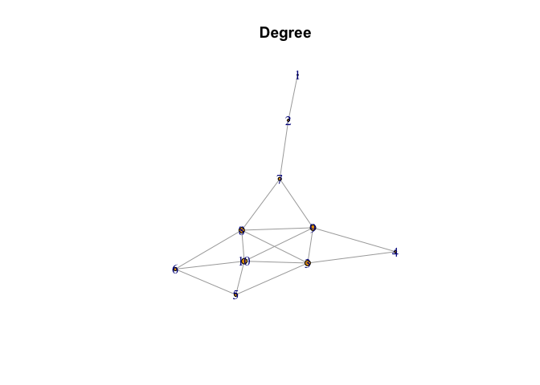

Exercise 2
================

The node and edge lists were made in excel files to be able to import
them easily.

``` r
nodes <- read_csv('nodes_list.csv')
```

    ## Rows: 10 Columns: 1
    ## ── Column specification ────────────────────────────────────────────────────────
    ## Delimiter: ","
    ## chr (1): Nodes
    ## 
    ## ℹ Use `spec()` to retrieve the full column specification for this data.
    ## ℹ Specify the column types or set `show_col_types = FALSE` to quiet this message.

``` r
edges <- read_csv('edge_list.csv')
```

    ## Rows: 17 Columns: 2
    ## ── Column specification ────────────────────────────────────────────────────────
    ## Delimiter: ","
    ## chr (2): Edge 1, Edge 2
    ## 
    ## ℹ Use `spec()` to retrieve the full column specification for this data.
    ## ℹ Specify the column types or set `show_col_types = FALSE` to quiet this message.

Next we can create the potential relationship network. this is used to
determine which seat has the most potential.

``` r
relationship_network <- tbl_graph(nodes=nodes, edges=edges, directed=FALSE)
Degree <- degree(relationship_network)
print(Degree)
```

    ##  [1] 1 2 5 2 3 3 3 5 5 5

``` r
closeness <- closeness(relationship_network)
print(closeness)
```

    ##  [1] 0.03333333 0.04545455 0.06250000 0.05000000 0.04761905 0.05263158
    ##  [7] 0.06250000 0.07142857 0.07142857 0.06250000

For evaluating which seat is best I will take into account degree and
closeness. Should note that the only seats available are ABCD (the last
4 in each list printed above) based on degree B,C and D all have the
same degree. Based on the closeness which is how central or close a node
is to all other nodes B and C have the highest values and are equal
(more desirable centrality). Based on this analysis seats B or C are
equivalently connected to the other seats on the bus.

Should note that if you select B you risk that D, C and A are not
filled, if you select C you also risk that D B and A are not filled so
each option has equal risk and as such either of them can be selected.

Now we can plot the network.

``` r
plot.igraph(relationship_network, 
            vertex.size=degree(relationship_network), 
            main="Degree")
```

<!-- -->
