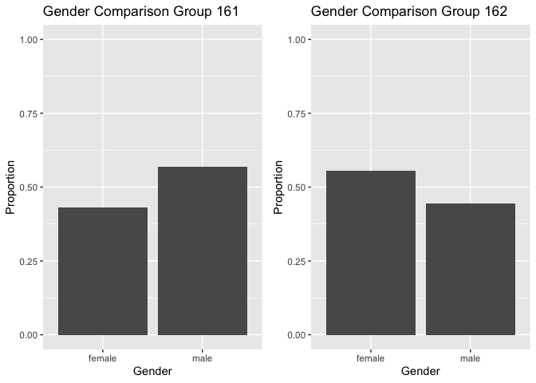
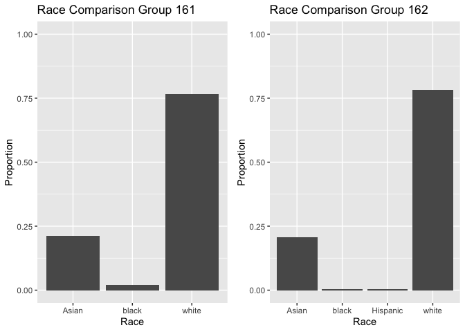
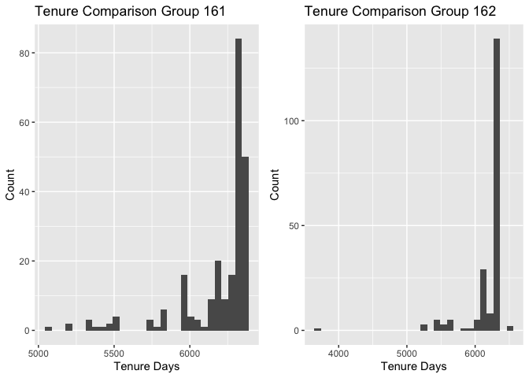
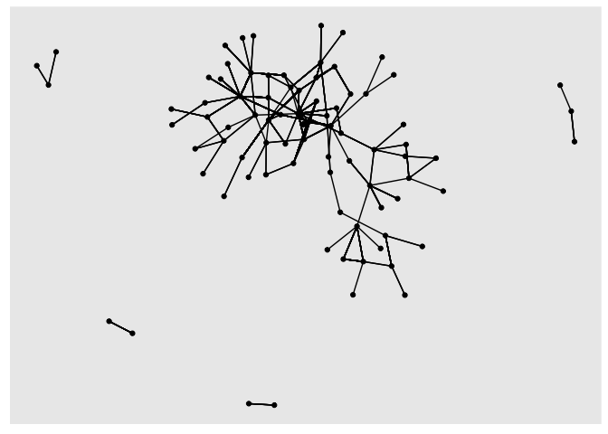
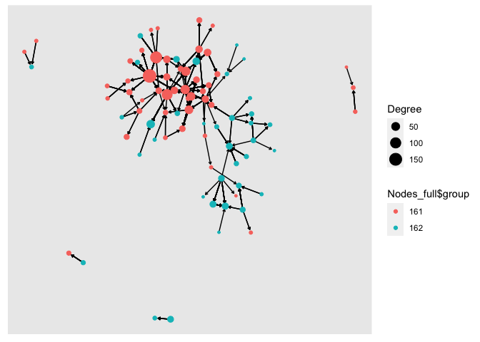
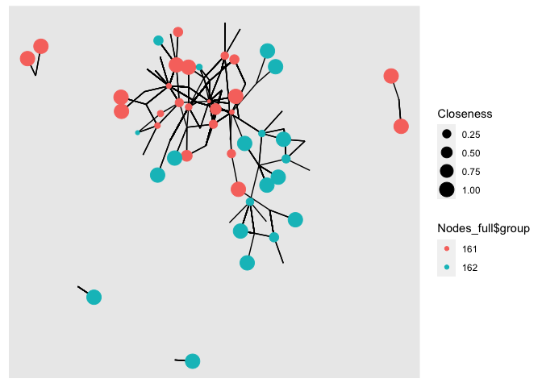

Exercise_3\_ONA_Keel_Scruton
================

Import/load all required packages.

## Load data

Load the following data: + applications from `app_data_sample.parquet` +
edges from `edges_sample.csv`

``` r
data_path <- "/Users/keelscruton/Desktop/Org Network Analysis/672_project_data/"
applications <- read_parquet(paste0(data_path,"app_data_sample.parquet"))
edges <- read_csv(paste0(data_path,"edges_sample.csv"))
```

    ## Rows: 32906 Columns: 4
    ## ── Column specification ────────────────────────────────────────────────────────
    ## Delimiter: ","
    ## chr  (1): application_number
    ## dbl  (2): ego_examiner_id, alter_examiner_id
    ## date (1): advice_date
    ## 
    ## ℹ Use `spec()` to retrieve the full column specification for this data.
    ## ℹ Specify the column types or set `show_col_types = FALSE` to quiet this message.

``` r
applications
```

    ## # A tibble: 2,018,477 × 16
    ##    application_number filing_date examiner_name_last examiner_name_first
    ##    <chr>              <date>      <chr>              <chr>              
    ##  1 08284457           2000-01-26  HOWARD             JACQUELINE         
    ##  2 08413193           2000-10-11  YILDIRIM           BEKIR              
    ##  3 08531853           2000-05-17  HAMILTON           CYNTHIA            
    ##  4 08637752           2001-07-20  MOSHER             MARY               
    ##  5 08682726           2000-04-10  BARR               MICHAEL            
    ##  6 08687412           2000-04-28  GRAY               LINDA              
    ##  7 08716371           2004-01-26  MCMILLIAN          KARA               
    ##  8 08765941           2000-06-23  FORD               VANESSA            
    ##  9 08776818           2000-02-04  STRZELECKA         TERESA             
    ## 10 08809677           2002-02-20  KIM                SUN                
    ## # … with 2,018,467 more rows, and 12 more variables:
    ## #   examiner_name_middle <chr>, examiner_id <dbl>, examiner_art_unit <dbl>,
    ## #   uspc_class <chr>, uspc_subclass <chr>, patent_number <chr>,
    ## #   patent_issue_date <date>, abandon_date <date>, disposal_type <chr>,
    ## #   appl_status_code <dbl>, appl_status_date <chr>, tc <dbl>

``` r
edges
```

    ## # A tibble: 32,906 × 4
    ##    application_number advice_date ego_examiner_id alter_examiner_id
    ##    <chr>              <date>                <dbl>             <dbl>
    ##  1 09402488           2008-11-17            84356             66266
    ##  2 09402488           2008-11-17            84356             63519
    ##  3 09402488           2008-11-17            84356             98531
    ##  4 09445135           2008-08-21            92953             71313
    ##  5 09445135           2008-08-21            92953             93865
    ##  6 09445135           2008-08-21            92953             91818
    ##  7 09479304           2008-12-15            61767             69277
    ##  8 09479304           2008-12-15            61767             92446
    ##  9 09479304           2008-12-15            61767             66805
    ## 10 09479304           2008-12-15            61767             70919
    ## # … with 32,896 more rows

## Get gender for examiners

We’ll get gender based on the first name of the examiner, which is
recorded in the field `examiner_name_first`. We’ll use library `gender`
for that, relying on a modified version of their own
[example](https://cran.r-project.org/web/packages/gender/vignettes/predicting-gender.hedges_examinerl).

Note that there are over 2 million records in the applications table –
that’s because there are many records for each examiner, as many as the
number of applications that examiner worked on during this time frame.
Our first step therefore is to get all *unique* names in a separate list
`examiner_names`. We will then guess gender for each one and will join
this table back to the original dataset. So, let’s get names without
repetition:

``` r
library(gender)
#install_genderdata_package() # only run this line the first time you use the package, to get data for it
# get a list of first names without repetitions
examiner_names <- applications %>% 
  distinct(examiner_name_first)
examiner_names
```

    ## # A tibble: 2,595 × 1
    ##    examiner_name_first
    ##    <chr>              
    ##  1 JACQUELINE         
    ##  2 BEKIR              
    ##  3 CYNTHIA            
    ##  4 MARY               
    ##  5 MICHAEL            
    ##  6 LINDA              
    ##  7 KARA               
    ##  8 VANESSA            
    ##  9 TERESA             
    ## 10 SUN                
    ## # … with 2,585 more rows

Now let’s use function `gender()` as shown in the example for the
package to attach a gender and probability to each name and put the
results into the table `examiner_names_gender`

``` r
# get a table of names and gender
examiner_names_gender <- examiner_names %>% 
  do(results = gender(.$examiner_name_first, method = "ssa")) %>% 
  unnest(cols = c(results), keep_empty = TRUE) %>% 
  select(
    examiner_name_first = name,
    gender,
    proportion_female
  )
examiner_names_gender
```

    ## # A tibble: 1,822 × 3
    ##    examiner_name_first gender proportion_female
    ##    <chr>               <chr>              <dbl>
    ##  1 AARON               male              0.0082
    ##  2 ABDEL               male              0     
    ##  3 ABDOU               male              0     
    ##  4 ABDUL               male              0     
    ##  5 ABDULHAKIM          male              0     
    ##  6 ABDULLAH            male              0     
    ##  7 ABDULLAHI           male              0     
    ##  8 ABIGAIL             female            0.998 
    ##  9 ABIMBOLA            female            0.944 
    ## 10 ABRAHAM             male              0.0031
    ## # … with 1,812 more rows

Finally, let’s join that table back to our original applications data
and discard the temporary tables we have just created to reduce clutter
in our environment.

``` r
# remove extra colums from the gender table
examiner_names_gender <- examiner_names_gender %>% 
  select(examiner_name_first, gender)
# joining gender back to the dataset
applications <- applications %>% 
  left_join(examiner_names_gender, by = "examiner_name_first")
# cleaning up
rm(examiner_names)
rm(examiner_names_gender)
gc()
```

    ##            used  (Mb) gc trigger  (Mb) limit (Mb) max used (Mb)
    ## Ncells  4675498 249.7    8077291 431.4         NA  5072548  271
    ## Vcells 49897673 380.7   93092310 710.3      16384 80213462  612

## Guess the examiner’s race

We’ll now use package `wru` to estimate likely race of an examiner. Just
like with gender, we’ll get a list of unique names first, only now we
are using surnames.

``` r
library(wru)
examiner_surnames <- applications %>% 
  select(surname = examiner_name_last) %>% 
  distinct()
examiner_surnames
```

    ## # A tibble: 3,806 × 1
    ##    surname   
    ##    <chr>     
    ##  1 HOWARD    
    ##  2 YILDIRIM  
    ##  3 HAMILTON  
    ##  4 MOSHER    
    ##  5 BARR      
    ##  6 GRAY      
    ##  7 MCMILLIAN 
    ##  8 FORD      
    ##  9 STRZELECKA
    ## 10 KIM       
    ## # … with 3,796 more rows

We’ll follow the instructions for the package outlined here
<https://github.com/kosukeimai/wru>.

``` r
examiner_race <- predict_race(voter.file = examiner_surnames, surname.only = T) %>% 
  as_tibble()
```

    ## [1] "Proceeding with surname-only predictions..."

    ## Warning in merge_surnames(voter.file): Probabilities were imputed for 698
    ## surnames that could not be matched to Census list.

``` r
examiner_race
```

    ## # A tibble: 3,806 × 6
    ##    surname    pred.whi pred.bla pred.his pred.asi pred.oth
    ##    <chr>         <dbl>    <dbl>    <dbl>    <dbl>    <dbl>
    ##  1 HOWARD       0.643   0.295    0.0237   0.005     0.0333
    ##  2 YILDIRIM     0.861   0.0271   0.0609   0.0135    0.0372
    ##  3 HAMILTON     0.702   0.237    0.0245   0.0054    0.0309
    ##  4 MOSHER       0.947   0.00410  0.0241   0.00640   0.0185
    ##  5 BARR         0.827   0.117    0.0226   0.00590   0.0271
    ##  6 GRAY         0.687   0.251    0.0241   0.0054    0.0324
    ##  7 MCMILLIAN    0.359   0.574    0.0189   0.00260   0.0463
    ##  8 FORD         0.620   0.32     0.0237   0.0045    0.0313
    ##  9 STRZELECKA   0.666   0.0853   0.137    0.0797    0.0318
    ## 10 KIM          0.0252  0.00390  0.00650  0.945     0.0198
    ## # … with 3,796 more rows

As you can see, we get probabilities across five broad US Census
categories: white, black, Hispanic, Asian and other. (Some of you may
correctly point out that Hispanic is not a race category in the US
Census, but these are the limitations of this package.)

Our final step here is to pick the race category that has the highest
probability for each last name and then join the table back to the main
applications table. See this example for comparing values across
columns: <https://www.tidyverse.org/blog/2020/04/dplyr-1-0-0-rowwise/>.
And this one for `case_when()` function:
<https://dplyr.tidyverse.org/reference/case_when.hedges_examinerl>.

``` r
examiner_race <- examiner_race %>% 
  mutate(max_race_p = pmax(pred.asi, pred.bla, pred.his, pred.oth, pred.whi)) %>% 
  mutate(race = case_when(
    max_race_p == pred.asi ~ "Asian",
    max_race_p == pred.bla ~ "black",
    max_race_p == pred.his ~ "Hispanic",
    max_race_p == pred.oth ~ "other",
    max_race_p == pred.whi ~ "white",
    TRUE ~ NA_character_
  ))
examiner_race
```

    ## # A tibble: 3,806 × 8
    ##    surname    pred.whi pred.bla pred.his pred.asi pred.oth max_race_p race 
    ##    <chr>         <dbl>    <dbl>    <dbl>    <dbl>    <dbl>      <dbl> <chr>
    ##  1 HOWARD       0.643   0.295    0.0237   0.005     0.0333      0.643 white
    ##  2 YILDIRIM     0.861   0.0271   0.0609   0.0135    0.0372      0.861 white
    ##  3 HAMILTON     0.702   0.237    0.0245   0.0054    0.0309      0.702 white
    ##  4 MOSHER       0.947   0.00410  0.0241   0.00640   0.0185      0.947 white
    ##  5 BARR         0.827   0.117    0.0226   0.00590   0.0271      0.827 white
    ##  6 GRAY         0.687   0.251    0.0241   0.0054    0.0324      0.687 white
    ##  7 MCMILLIAN    0.359   0.574    0.0189   0.00260   0.0463      0.574 black
    ##  8 FORD         0.620   0.32     0.0237   0.0045    0.0313      0.620 white
    ##  9 STRZELECKA   0.666   0.0853   0.137    0.0797    0.0318      0.666 white
    ## 10 KIM          0.0252  0.00390  0.00650  0.945     0.0198      0.945 Asian
    ## # … with 3,796 more rows

Let’s join the data back to the applications table.

``` r
# removing extra columns
examiner_race <- examiner_race %>% 
  select(surname,race)
applications <- applications %>% 
  left_join(examiner_race, by = c("examiner_name_last" = "surname"))
rm(examiner_race)
rm(examiner_surnames)
gc()
```

    ##            used  (Mb) gc trigger  (Mb) limit (Mb) max used  (Mb)
    ## Ncells  5090133 271.9    8077291 431.4         NA  8077291 431.4
    ## Vcells 53698624 409.7   93092310 710.3      16384 92792973 708.0

## Examiner’s tenure

To figure out the timespan for which we observe each examiner in the
applications data, let’s find the first and the last observed date for
each examiner. We’ll first get examiner IDs and application dates in a
separate table, for ease of manipulation. We’ll keep examiner ID (the
field `examiner_id`), and earliest and latest dates for each application
(`filing_date` and `appl_status_date` respectively). We’ll use functions
in package `lubridate` to work with date and time values.

``` r
library(lubridate) # to work with dates
examiner_dates <- applications %>% 
  select(examiner_id, filing_date, appl_status_date) 
examiner_dates
```

    ## # A tibble: 2,018,477 × 3
    ##    examiner_id filing_date appl_status_date  
    ##          <dbl> <date>      <chr>             
    ##  1       96082 2000-01-26  30jan2003 00:00:00
    ##  2       87678 2000-10-11  27sep2010 00:00:00
    ##  3       63213 2000-05-17  30mar2009 00:00:00
    ##  4       73788 2001-07-20  07sep2009 00:00:00
    ##  5       77294 2000-04-10  19apr2001 00:00:00
    ##  6       68606 2000-04-28  16jul2001 00:00:00
    ##  7       89557 2004-01-26  15may2017 00:00:00
    ##  8       97543 2000-06-23  03apr2002 00:00:00
    ##  9       98714 2000-02-04  27nov2002 00:00:00
    ## 10       65530 2002-02-20  23mar2009 00:00:00
    ## # … with 2,018,467 more rows

The dates look inconsistent in terms of formatting. Let’s make them
consistent. We’ll create new variables `start_date` and `end_date`.

``` r
examiner_dates <- examiner_dates %>% 
  mutate(start_date = ymd(filing_date), end_date = as_date(dmy_hms(appl_status_date)))
```

Let’s now identify the earliest and the latest date for each examiner
and calculate the difference in days, which is their tenure in the
organization.

``` r
examiner_dates <- examiner_dates %>% 
  group_by(examiner_id) %>% 
  summarise(
    earliest_date = min(start_date, na.rm = TRUE), 
    latest_date = max(end_date, na.rm = TRUE),
    tenure_days = interval(earliest_date, latest_date) %/% days(1)
    ) %>% 
  filter(year(latest_date)<2018)
examiner_dates
```

    ## # A tibble: 5,625 × 4
    ##    examiner_id earliest_date latest_date tenure_days
    ##          <dbl> <date>        <date>            <dbl>
    ##  1       59012 2004-07-28    2015-07-24         4013
    ##  2       59025 2009-10-26    2017-05-18         2761
    ##  3       59030 2005-12-12    2017-05-22         4179
    ##  4       59040 2007-09-11    2017-05-23         3542
    ##  5       59052 2001-08-21    2007-02-28         2017
    ##  6       59054 2000-11-10    2016-12-23         5887
    ##  7       59055 2004-11-02    2007-12-26         1149
    ##  8       59056 2000-03-24    2017-05-22         6268
    ##  9       59074 2000-01-31    2017-03-17         6255
    ## 10       59081 2011-04-21    2017-05-19         2220
    ## # … with 5,615 more rows

Joining back to the applications data.

``` r
applications <- applications %>% 
  left_join(examiner_dates, by = "examiner_id")
rm(examiner_dates)
gc()
```

    ##            used  (Mb) gc trigger   (Mb) limit (Mb)  max used   (Mb)
    ## Ncells  5103605 272.6   14580022  778.7         NA  14580022  778.7
    ## Vcells 66076227 504.2  134228926 1024.1      16384 133664998 1019.8

##Begining of work not included in class github. ### Section 2: The two
work groups (groups) we will focus on are 161 and 162 Here we create
subgroups that only contain those instances. We will also ensure we only
display unique instances of each examiner.

``` r
vars <- c("gender","race","tenure_days")
applications = drop_na(applications,any_of(vars))
```

``` r
group_161 <- applications[substr(applications$examiner_art_unit, 1, 3) == 161,]
group_161 <-group_161[row.names(unique(group_161[,"examiner_id"])),]


group_162 <- applications[substr(applications$examiner_art_unit, 1, 3) == 162,]
group_162 <-group_162[row.names(unique(group_162[,"examiner_id"])),]
```

create some summary statistics

``` r
summary(group_161)
```

    ##  application_number  filing_date         examiner_name_last examiner_name_first
    ##  Length:236         Min.   :2000-01-03   Length:236         Length:236         
    ##  Class :character   1st Qu.:2000-01-18   Class :character   Class :character   
    ##  Mode  :character   Median :2000-02-12   Mode  :character   Mode  :character   
    ##                     Mean   :2000-03-06                                         
    ##                     3rd Qu.:2000-03-23                                         
    ##                     Max.   :2002-10-30                                         
    ##                                                                                
    ##  examiner_name_middle  examiner_id    examiner_art_unit  uspc_class       
    ##  Length:236           Min.   :59399   Min.   :1613      Length:236        
    ##  Class :character     1st Qu.:68134   1st Qu.:1614      Class :character  
    ##  Mode  :character     Median :90588   Median :1615      Mode  :character  
    ##                       Mean   :82510   Mean   :1615                        
    ##                       3rd Qu.:95415   3rd Qu.:1616                        
    ##                       Max.   :99428   Max.   :1619                        
    ##                                                                           
    ##  uspc_subclass      patent_number      patent_issue_date   
    ##  Length:236         Length:236         Min.   :2000-07-18  
    ##  Class :character   Class :character   1st Qu.:2001-10-02  
    ##  Mode  :character   Mode  :character   Median :2002-05-31  
    ##                                        Mean   :2002-10-04  
    ##                                        3rd Qu.:2003-02-28  
    ##                                        Max.   :2011-04-19  
    ##                                        NA's   :58          
    ##   abandon_date        disposal_type      appl_status_code appl_status_date  
    ##  Min.   :2000-07-29   Length:236         Min.   :150.0    Length:236        
    ##  1st Qu.:2001-06-15   Class :character   1st Qu.:150.0    Class :character  
    ##  Median :2002-03-17   Mode  :character   Median :161.0    Mode  :character  
    ##  Mean   :2002-06-18                      Mean   :199.4                      
    ##  3rd Qu.:2003-01-18                      3rd Qu.:250.0                      
    ##  Max.   :2009-08-04                      Max.   :250.0                      
    ##  NA's   :178                                                                
    ##        tc          gender              race           earliest_date       
    ##  Min.   :1600   Length:236         Length:236         Min.   :2000-01-03  
    ##  1st Qu.:1600   Class :character   Class :character   1st Qu.:2000-01-03  
    ##  Median :1600   Mode  :character   Mode  :character   Median :2000-01-05  
    ##  Mean   :1600                                         Mean   :2000-01-07  
    ##  3rd Qu.:1600                                         3rd Qu.:2000-01-07  
    ##  Max.   :1600                                         Max.   :2000-05-16  
    ##                                                                           
    ##   latest_date          tenure_days  
    ##  Min.   :2013-11-01   Min.   :5050  
    ##  1st Qu.:2016-12-21   1st Qu.:6197  
    ##  Median :2017-04-28   Median :6318  
    ##  Mean   :2016-12-21   Mean   :6192  
    ##  3rd Qu.:2017-05-18   3rd Qu.:6343  
    ##  Max.   :2017-05-23   Max.   :6350  
    ## 

``` r
print('----------------------Next Group ---------------------------')
```

    ## [1] "----------------------Next Group ---------------------------"

``` r
summary(group_162)
```

    ##  application_number  filing_date         examiner_name_last examiner_name_first
    ##  Length:202         Min.   :2000-01-03   Length:202         Length:202         
    ##  Class :character   1st Qu.:2000-01-19   Class :character   Class :character   
    ##  Mode  :character   Median :2000-02-22   Mode  :character   Mode  :character   
    ##                     Mean   :2000-03-29                                         
    ##                     3rd Qu.:2000-04-03                                         
    ##                     Max.   :2004-01-26                                         
    ##                                                                                
    ##  examiner_name_middle  examiner_id    examiner_art_unit  uspc_class       
    ##  Length:202           Min.   :59632   Min.   :1621      Length:202        
    ##  Class :character     1st Qu.:65737   1st Qu.:1623      Class :character  
    ##  Mode  :character     Median :72272   Median :1624      Mode  :character  
    ##                       Mean   :77689   Mean   :1624                        
    ##                       3rd Qu.:92995   3rd Qu.:1625                        
    ##                       Max.   :99721   Max.   :1629                        
    ##                                                                           
    ##  uspc_subclass      patent_number      patent_issue_date   
    ##  Length:202         Length:202         Min.   :2000-10-17  
    ##  Class :character   Class :character   1st Qu.:2001-07-17  
    ##  Mode  :character   Mode  :character   Median :2001-11-06  
    ##                                        Mean   :2002-02-22  
    ##                                        3rd Qu.:2002-06-18  
    ##                                        Max.   :2010-11-09  
    ##                                        NA's   :53          
    ##   abandon_date        disposal_type      appl_status_code appl_status_date  
    ##  Min.   :2000-09-20   Length:202         Min.   :135.0    Length:202        
    ##  1st Qu.:2001-04-27   Class :character   1st Qu.:161.0    Class :character  
    ##  Median :2001-08-16   Mode  :character   Median :250.0    Mode  :character  
    ##  Mean   :2002-02-19                      Mean   :203.3                      
    ##  3rd Qu.:2002-04-24                      3rd Qu.:250.0                      
    ##  Max.   :2011-08-29                      Max.   :250.0                      
    ##  NA's   :150                                                                
    ##        tc          gender              race           earliest_date       
    ##  Min.   :1600   Length:202         Length:202         Min.   :2000-01-03  
    ##  1st Qu.:1600   Class :character   Class :character   1st Qu.:2000-01-04  
    ##  Median :1600   Mode  :character   Mode  :character   Median :2000-01-06  
    ##  Mean   :1600                                         Mean   :2000-01-11  
    ##  3rd Qu.:1600                                         3rd Qu.:2000-01-11  
    ##  Max.   :1600                                         Max.   :2001-12-19  
    ##                                                                           
    ##   latest_date          tenure_days  
    ##  Min.   :2010-04-05   Min.   :3700  
    ##  1st Qu.:2016-11-10   1st Qu.:6153  
    ##  Median :2017-04-24   Median :6316  
    ##  Mean   :2017-01-02   Mean   :6201  
    ##  3rd Qu.:2017-05-19   3rd Qu.:6339  
    ##  Max.   :2017-11-08   Max.   :6518  
    ## 

Next we can create some plots to better compare the two groups based on
demographics.

##Gender breakdown First we will compare based on gender.

``` r
library(gridExtra)
```

    ## 
    ## Attaching package: 'gridExtra'

    ## The following object is masked from 'package:dplyr':
    ## 
    ##     combine

``` r
gender_161 <- ggplot(data=group_161, aes(x=gender)) +
  geom_bar(aes(y = (..count..)/sum(..count..)) )  +
  ylab("Proportion")+
  xlab("Gender")+
  ylim(0,1)+
  ggtitle(paste0("Gender Comparison Group 161"))


gender_162 <- ggplot(data=group_162, aes(x=gender)) +
  geom_bar(aes(y = (..count..)/sum(..count..))) +
  ylab("Proportion")+
  xlab("Gender")+
  ylim(0,1)+
  ggtitle(paste0("Gender Comparison Group 162"))

grid.arrange(gender_161,gender_162,ncol=2, widths=c(1,1))
```

<!-- -->
From the above plots we can see that group 161 has more male examiners,
group 162 has more female examiners. Should note that all NA values for
gender were dropped, these values could not be estimated based on our
methods and so in reality could alter the results shown here. we can
possibly assume that the distribution would be representative of the
distributions we see here.

##Race breakdown Next we will compare based on race

``` r
library(gridExtra)
race_161 <- ggplot(data=group_161, aes(x=race)) +
  geom_bar(aes(y = (..count..)/sum(..count..)) )  +
  ylab("Proportion")+
  xlab("Race")+
  ylim(0,1)+
  ggtitle(paste0("Race Comparison Group 161"))


race_162 <- ggplot(data=group_162, aes(x=race)) +
  geom_bar(aes(y = (..count..)/sum(..count..))) +
  ylab("Proportion")+
  xlab("Race")+
  ylim(0,1)+
  ggtitle(paste0("Race Comparison Group 162"))

grid.arrange(race_161,race_162,ncol=2, widths=c(1,1))
```

<!-- -->
From these results we can see that group 161 and 162 both have more
white examiners than any other group. at just over 75% for each, as well
both groups also have just under 25% of the examiner population being
Asian. the biggest difference is that there is slightly more black
examiners in group 161 then in 162 and there apears to be some minimal
number of hispanic examiners in group 162 that is not present in 161.

##Tenure breakdown Next we will compare based on tenure (tenure days)

``` r
library(gridExtra)
a= ggplot(data=group_161, aes(group_161$tenure_days)) + geom_histogram()+  ggtitle(paste0("Tenure Comparison Group 161"))+ylab("Count")+
  xlab("Tenure Days")

b= ggplot(data=group_162, aes(group_162$tenure_days)) + geom_histogram() +ggtitle(paste0("Tenure Comparison Group 162"))+ylab("Count")+
  xlab("Tenure Days")


grid.arrange(a,b,ncol=2, widths=c(1,1))
```

    ## Warning: Use of `group_161$tenure_days` is discouraged. Use `tenure_days`
    ## instead.

    ## `stat_bin()` using `bins = 30`. Pick better value with `binwidth`.

    ## Warning: Use of `group_162$tenure_days` is discouraged. Use `tenure_days`
    ## instead.

    ## `stat_bin()` using `bins = 30`. Pick better value with `binwidth`.

<!-- -->

Observing the tenure differences between the groups we can see that the
tenure distributions are very similar above the 6000 days mark (\~16
years). However in group 161 there is a group of examiners who have a
shorter tenure under 5500 days. Both groups are mostly made up of
examiners who have been there at least 5000 days (\~13 years)

### Section 3:

Create advice networks from `edges_sample` and calculate centrality
scores for examiners in your selected workgroups

``` r
#create distinct subset of examiners with only the art unit and examiner id to be able to re join onto our other data afterwards
examiner_dis = distinct(subset(applications, select=c(examiner_art_unit, examiner_id)))
examiner_dis$group = substr(examiner_dis$examiner_art_unit, 1,3)
#get rid of all examiners except those in group 161 or 162
examiner_dis = examiner_dis[examiner_dis$group==161 | examiner_dis$group==162,]
```

Now that we have a list of the examiners who are part of work groups 161
and 162 we can combine (merge) it with the edge list (edges) this will
allow us to form our subset network.

``` r
edges_examiner = merge(x=edges, y=examiner_dis, by.x="ego_examiner_id", by.y="examiner_id", all.x=TRUE)
edges_examiner = edges_examiner %>% rename(ego_au=examiner_art_unit, ego_group=group)

edges_examiner = merge(x=edges_examiner, y=examiner_dis, by.x="alter_examiner_id", by.y="examiner_id", all.x=TRUE)
edges_examiner = edges_examiner %>% rename(alter_au=examiner_art_unit, alter_group=group)

edges_examiner = drop_na(edges_examiner) #drop all na, ie values not in the selected workgroups. 
```

Now the above data set has the edges of alter and ego examiners. we can
next create the list of nodes for both the ego and alter examiners.

``` r
Ego_nodes = subset(edges_examiner, select=c(ego_examiner_id,ego_au, ego_group)) %>% rename(examiner_id=ego_examiner_id,art_unit=ego_au,group=ego_group)

Alter_nodes = subset(edges_examiner, select=c(alter_examiner_id,alter_au, alter_group))%>% rename(examiner_id=alter_examiner_id,art_unit=alter_au,group=alter_group)

Nodes_full = distinct(rbind(Ego_nodes, Alter_nodes))

#Nodes_full is a list of all the distinct examiners involved in the advice network
```

Now we can create the graph network.

``` r
#ran into error where i had duplicated vertex names, to fix take the first instances only in the nodes list. 

Nodes_full = Nodes_full %>% group_by(examiner_id) %>% summarise(examiner_id=first(examiner_id), art_unit=first(art_unit), group=first(group))

network <- graph_from_data_frame(d=edges_examiner, vertices=Nodes_full, directed=TRUE)


#Print the simple network with no account for degree or visualisation of the two units
ggraph(network, layout="kk") +
  geom_edge_link()+
  geom_node_point()
```

<!-- -->

To be able to make a better graph we need to calculate the degree of
each node. as well we need to calculate a measure of centrality. As this
is an advice network, i am assuming that it would be the most
advantageous to be able to reach out easily across the network to the
most people possible to be able to get help with a patent case. as such
I believe that closeness is the most advantageous. This value would help
find the examiners who are best connected to the network for efficiency
of informational travel between nodes.

``` r
Degree <- degree(network)
Closeness <- closeness(network)

ggraph(network, layout="kk") +
  geom_edge_link(arrow = arrow(length = unit(1, 'mm')), 
                 end_cap = circle(1.2, 'mm'))+
  geom_node_point(aes(size=Degree, color=Nodes_full$group), show.legend=T)
```

<!-- -->

From the above graph we can see that those in group 161 have much bigger
nodes, meaning that each examiner seems to be connected to more people
than those examiners in group 162. As well in the bottom right we can
see there seems to be a segmented group of connected examiners from
group 162 whereas the group of connected examiners from 161 is also
fairly well connected to other members from 162. we also have a few
outliers of small connections that do not mix or connect with the main
group and are isolated. Just visually observing the arrows that
represent direction, there seem to be many examiners in the 161 group
that have many connections (degree) but have arrows going away from
them, (they seek lots of advice?) There are also equaly a few nodes in
the 162 clusters that everyone seems to come to for advice.

Contrasting with the results of the demographic analysis we found that
group 161 has more males and has a greater distribution across tenure.
The greater distribution of tenure could explain why those examiners are
more willing/needing of seeking out advice, and requiring a strong
network in order to get the work done effectively. Effectively there was
no real differences between the two groups on race so it is probably not
having an effect here. group 162 that had more female examiners seem to
go to themselves for advice more (members of the same group) but i doubt
this is correlated because the proportion of male to female in both
groups is not very different (very small difference in proportion)

``` r
ggraph(network, layout="kk") +
  geom_edge_link()+
  geom_node_point(aes(size=Closeness, color=Nodes_full$group), show.legend=T)
```

    ## Warning: Removed 41 rows containing missing values (geom_point).

<!-- -->
